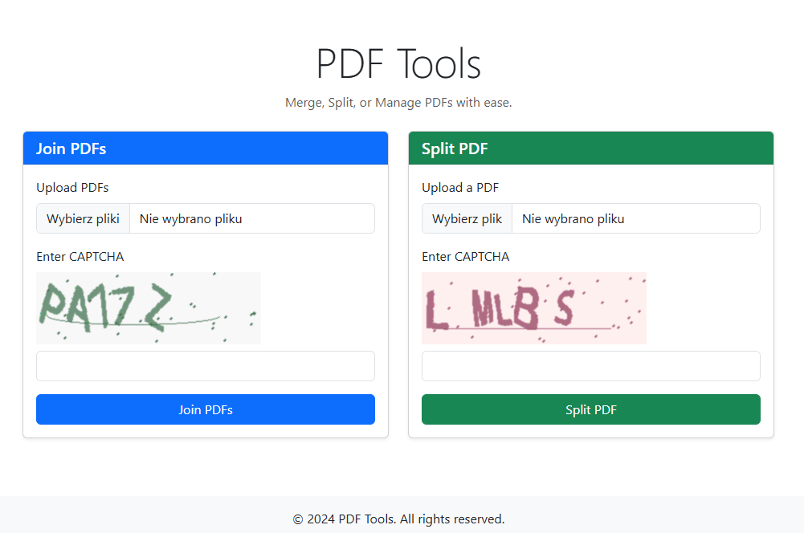

# PDF Tool Application



This application provides a web interface for merging and splitting PDF files with security features including CAPTCHA validation and content security policies.

## Features

- **Merge PDFs**: Combine multiple PDF files into a single document
- **Split PDF**: Split a single PDF file into individual pages
- **CAPTCHA Validation**: Prevents spam and ensures bot protection
- **Security Headers**: Content Security Policy (CSP) and HSTS headers
- **File Upload Protection**: Path traversal prevention and file type validation
- **Secure Session Management**: Cryptographically secure secret key handling
- **Rate Limiting**: Prevents abuse with configurable request limits

## Prerequisites

- Python 3.8 or higher
- pip (Python package manager)

## Installation

### 1. Clone the repository

```bash
git clone https://github.com/draprar/flask-pdf-tools_pdfy.git
cd flask-pdf-tools_pdfy
```

### 2. Create and activate virtual environment

```bash
# On Linux/MacOS
python3 -m venv venv
source venv/bin/activate

# On Windows
python -m venv venv
venv\Scripts\activate
```

### 3. Install dependencies

```bash
pip install -r requirements.txt
```

### 4. Set up environment variables

Copy `.env.example` to `.env` and configure:

```bash
# On Linux/macOS
cp .env.example .env

# On Windows (PowerShell)
Copy-Item .env.example .env

# On Windows (CMD)
copy .env.example .env
```

Edit `.env` with your settings:

```dotenv
FLASK_ENV=development
APP_SECRET_KEY=your_secure_secret_key_here
MAX_CONTENT_LENGTH=10485760
UPLOAD_FOLDER=uploads
CLEANUP_INTERVAL=3600
PORT=5000
```

**Important**: For production, generate a secure secret key:

```bash
python -c "import secrets; print(secrets.token_hex(32))"
```

And set it in your `.env` file:

```
APP_SECRET_KEY=<generated-key-here>
```

### 5. Create uploads directory

```bash
# On Linux/macOS
mkdir -p uploads

# On Windows (PowerShell)
New-Item -ItemType Directory -Path uploads -Force

# On Windows (CMD)
mkdir uploads
```

## Running the Application

### Development Mode

```bash
python app.py
```

The application will be available at `http://localhost:5000`

### Production Mode

For production on Linux/macOS, use gunicorn:

```bash
FLASK_ENV=production gunicorn -w 4 -b 0.0.0.0:5000 app:app
```

Gunicorn does not natively run on Windows. On Windows, use Docker/WSL for production deployment.

### Docker

Build and run with Docker:

```bash
docker build -t flask-pdf-tools .
docker compose up
```

If your Docker setup still uses the legacy plugin, use `docker-compose up` instead.

## File Cleanup

To remove old uploaded files:

```bash
python -m flask_app.cleanup
```

Schedule this to run periodically (e.g., with cron):

```bash
# Run cleanup every hour
0 * * * * cd /path/to/app && python -m flask_app.cleanup
```

### Linux/macOS (cron)

Edit your crontab:

```bash
crontab -e
```

Add:

```bash
0 * * * * cd /path/to/flask-pdf-tools_pdfy && python -m flask_app.cleanup
```

### Windows (Task Scheduler)

Create an hourly task from Command Prompt:

```bat
schtasks /Create /SC HOURLY /MO 1 /TN "PDF Cleanup" /TR "cmd /c cd /d C:\path\to\flask-pdf-tools_pdfy && python -m flask_app.cleanup" /F
```

If you prefer the GUI, in Task Scheduler set:
- Program/script: `python`
- Add arguments: `-m flask_app.cleanup`
- Start in: `C:\path\to\flask-pdf-tools_pdfy`

## Security Features

### Content Security Policy (CSP)
- Restricts script execution to trusted sources
- Prevents inline style injection
- Allows scripts from CDN sources only

### Session Security
- Cryptographically secure secret keys (using `secrets` module)
- Secure session cookies
- CSRF protection with Flask-WTF

### File Upload Security
- Path traversal prevention in download endpoint
- File type validation (PDF only)
- Unique filename generation with UUIDs
- File size limits configurable via `MAX_CONTENT_LENGTH`

### CAPTCHA Protection
- Cryptographically secure random string generation
- Image-based CAPTCHA validation
- Protection against automated abuse

### Rate Limiting
- Configurable request limits per IP
- Prevents brute force and DoS attacks

## Testing

Run the test suite:

```bash
pytest
```

Run tests with coverage:

```bash
pytest --cov=flask_app tests/
```

## Configuration

Configuration is managed through environment variables in `.env`:

| Variable | Default | Description |
|----------|---------|-------------|
| `FLASK_ENV` | `development` | Environment mode: `development` or `production` |
| `APP_SECRET_KEY` | (auto-generated) | Secret key for session encryption |
| `MAX_CONTENT_LENGTH` | `10485760` | Maximum upload size in bytes (10MB) |
| `UPLOAD_FOLDER` | `uploads` | Directory for storing uploaded/processed files |
| `CLEANUP_INTERVAL` | `3600` | Cleanup interval in seconds (1 hour) |
| `PORT` | `5000` | Server port (when running directly) |

## Project Structure

```
flask-pdf-tools_pdfy/
├── app.py                 # Application entry point
├── requirements.txt       # Python dependencies
├── .env.example          # Environment variables template
├── .gitignore            # Git ignore rules
├── Dockerfile            # Docker configuration
├── docker-compose.yml    # Docker Compose configuration
├── nginx.conf            # Nginx reverse proxy configuration
├── logs/                 # Application logs
├── uploads/              # Uploaded and processed files
├── flask_app/
│   ├── __init__.py       # Flask app factory
│   ├── config.py         # Configuration classes
│   ├── routes.py         # Application routes
│   ├── forms.py          # WTForms form definitions
│   ├── utils.py          # Utility functions
│   ├── cleanup.py        # File cleanup script
│   ├── logging_config.py    # Logging configuration
│   ├── rate_limiter.py       # Rate limiting functionality
│   └── templates/        # HTML templates
│       ├── home.html     # Home page
│       ├── download.html # Download page
│       ├── 404.html      # 404 error page
│       └── 500.html      # 500 error page
└── tests/
    ├── test_app.py       # Unit and integration tests
    └── test_security.py     # Security-related tests
```

## Troubleshooting

### Upload folder not created
- Check permissions in parent directory
- Ensure `UPLOAD_FOLDER` path is valid

### CAPTCHA not validating
- Clear browser cookies and try again
- Check that session is properly configured

### PDF merge/split fails
- Ensure uploaded file is a valid PDF
- Check file size doesn't exceed `MAX_CONTENT_LENGTH`

## License

This project is licensed under the MIT License - see the LICENSE file for details.

## Security Considerations

This application is designed with security best practices in mind:

- Uses Flask-Talisman for security headers
- Implements CSRF protection
- Prevents path traversal attacks
- Validates all file uploads
- Uses cryptographically secure random generation
- Removes `unsafe-inline` from CSP headers

For production deployments:
1. Always use a secure `APP_SECRET_KEY`
2. Set `FLASK_ENV=production`
3. Use a reverse proxy (nginx) with HTTPS
4. Keep dependencies updated
5. Monitor logs for suspicious activity
6. Enable cleanup task for uploaded files

## Support

For issues and questions, please open an issue on GitHub.
